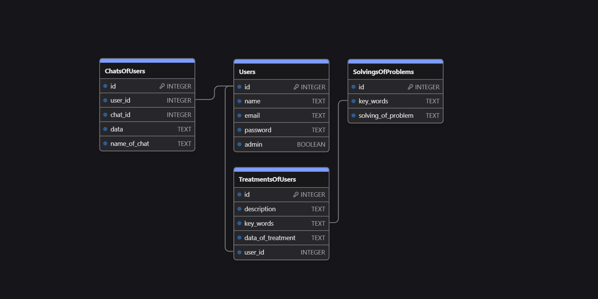
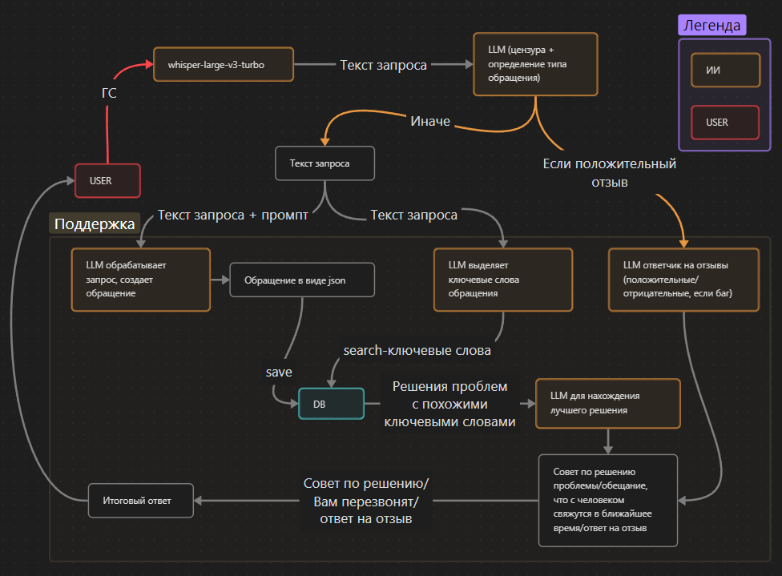

# VoiceHub

## Описание проекта

VoiceHub - это веб-приложение, которое предоставляет пользователям возможность взаимодействовать с голосовым ассистентом для решения проблем.

## Как запустить проект

### 1. Клонируем git-repo

```bash
git clone https://github.com/KirillCodeCreator/CodeFest
```

### 2. Переходим в нужную директорию

```bash
cd ./CodeFest
```

### 3. Создаём venv

```bash
# Windows
python -m venv venv
# Linux/MacOs
python3 -m venv venv
```

### 4. Активируем venv

```bash
# Windows
venv/Scripts/activate
# Linux/MacOs
source venv/bin/activate
```

### 5. Скачиваем зависимости

```bash
# Windows
pip install -r ./requirements/prod.txt
# Linux/MacOs
pip3 install -r ./requirements/prod.txt
```

### 6. Запускаем проект

```bash
# Windows
python run.py
# Linux/MacOs
python3 run.py
```

### 7. Видим что-то такое

```python
 * Подключение к базе данных по адресу sqlite:///db/app.db?check_same_thread=False
 * Serving Flask app 'app'
 * Debug mode: on
WARNING: This is a development server. Do not use it in a production deployment. Use a production WSGI server instead.
 * Running on http://127.0.0.1:5000
Press CTRL+C to quit
 * Restarting with stat
 * Подключение к базе данных по адресу sqlite:///db/app.db?check_same_thread=False
 * Debugger is active!
 * Debugger PIN: 775-608-152
```

## БД



## Логика

### Логика бэка с ИИ



### Логика тестирования/сбора метрик


